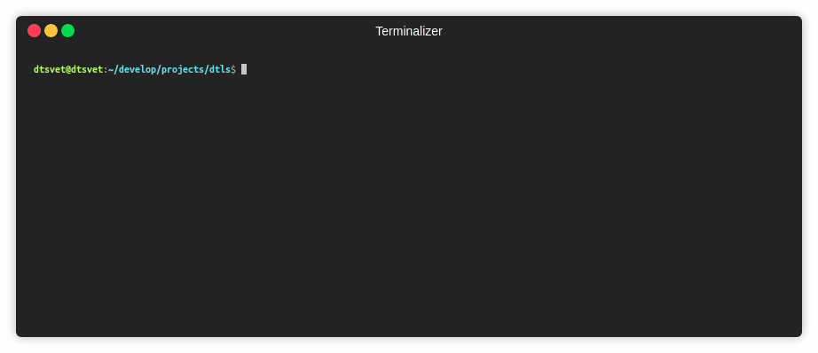

# @nodertc/dtls

[](https://travis-ci.org/nodertc/dtls)
[](https://www.npmjs.com/package/@nodertc/dtls)
[](https://www.npmjs.com/package/@nodertc/dtls)
[](https://www.npmjs.com/package/@nodertc/dtls)
[](https://www.npmjs.com/package/@nodertc/dtls)

Secure UDP communications using Datagram Transport Layer Security protocol version 1.2 in **pure js**. Follow [RFC6347](https://tools.ietf.org/html/rfc6347), [RFC7627](https://tools.ietf.org/html/rfc7627).

[](https://asciinema.org/a/195096)

### Features

* no native dependecies!
* modern secure ciphers - AEAD (`AES GCM` right now and `CHACHA20-POLY1305` in future)
* support set / get MTU
* in / out handshake fragmentation
* handshake retransmission
* merge outgoing handshakes

### Usage

```
npm i @nodertc/dtls
```

```js
const dtls = require('@nodertc/dtls');

const socket = dtls.connect({
  remotePort: 4444,
  remoteAddress: '127.0.0.1',
});

socket.on('error', err => {
  console.error(err);
});

socket.on('data', data => {
  console.log('got message "%s"', data.toString('ascii'));
  socket.close();
});

socket.once('connect', () => {
  socket.write('Hello from Node.js!');
});
```

### Suppored ciphers:

* TLS_RSA_WITH_AES_128_GCM_SHA256
* TLS_RSA_WITH_AES_256_GCM_SHA384
* TLS_RSA_WITH_AES_128_CCM
* TLS_RSA_WITH_AES_256_CCM

### API

* `dtls.connect(options: Options [, callback: function]) : Socket`

Creates an esteblished connection to remote dtls server. A `connect()` function also accept all options for [`unicast.createSocket()`](https://www.npmjs.com/package/unicast) or [`dgram.createSocket()`](https://nodejs.org/dist/latest-v8.x/docs/api/dgram.html#dgram_dgram_createsocket_options_callback). If `options.socket` is provided, these options will be ignored.

The `callback` function, if specified, will be added as a listener for the 'connect' event.

* `options.socket`

Optional [unicast](https://www.npmjs.com/package/unicast) or [dgram](https://nodejs.org/dist/latest-v8.x/docs/api/dgram.html) socket instance. Used if you want a low level control of your connection.

* `options.extendedMasterSecret: bool, [default=true]`

This option enable the use [Extended Master Secret](https://tools.ietf.org/html/rfc7627) extension. Enabled by default.

* `class Socket`

A `Socket` is also a [duplex stream](https://nodejs.org/api/stream.html#stream_class_stream_duplex), so it can be both readable and writable, and it is also a [EventEmitter](https://nodejs.org/api/events.html#events_class_eventemitter).

* `Socket.setMTU(mtu: number): void`

Set MTU (minimal transfer unit) for this socket, 1420 bytes maximal.

* `Socket.getMTU(): number`

Return MTU (minimal transfer unit) for this socket, 1200 bytes by default.

* `Socket.close(): void`

Close socket, stop listening for socket. Do not emit `data` events anymore.

* `Event: connect`

The 'connect' event is emitted after the handshaking process for a new connection has successfully completed.

### How to debug?

Start openssl dtls server:

```sh
npm run openssl-server
```

or start GnuTLS dtls server (more debug messages):

```sh
# tested in Ubuntu 16, use docker if you are Windows / MacOS user.
npm run gnutls-server
```

Start default client:

```sh
npm start
```

## TODO

* [ ] handle reordered handshake messages
* [ ] set ALPN
* [ ] server
* [ ] handle rehandshake
* [ ] heartbleat extension

## License

MIT, 2018 &copy; Dmitriy Tsvettsikh
